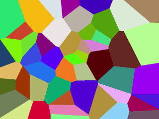

# Animated Wang Tiles
My implementation of (animated) Wang Tiles written in [Processing](https://processing.org).



## Quick start
### Windows
#### Via command line
*(may also work on Linux but wasn't tested)*
```console
$ processing-java --sketch=path/to/wang --run
```
**Note:** `path/to/wang` is a path to the directory containing `wang.pde`.
#### Via Processing IDE
1. Open wang.pde in Processing IDE.
2. Run the sketch.
